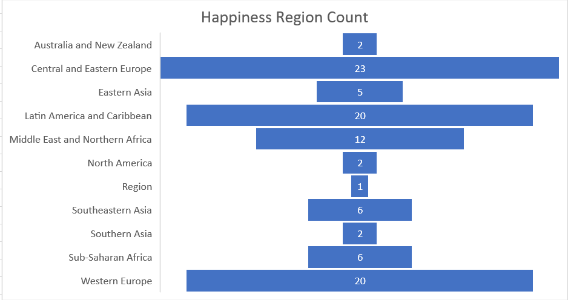

# Swarupa Pedapalli -map - reduce - World Happiness Report
## Dataset Link :
Link: [Raw Dataset](https://www.kaggle.com/unsdsn/world-happiness)

## About Data:
The World Happiness Report is a landmark survey of the state of global happiness.The reports review the state of happiness in the world today and show how the new science of happiness explains personal and national variations in happiness.

## Question you want answered:
Finding the happiness region count ?
 - From the results we got to know that central and eastern europe counts high compared to the other regions.Mapper output gives us the regions(since key value "region" is selected).Later when reducing is done it gave us the count of the regions.

